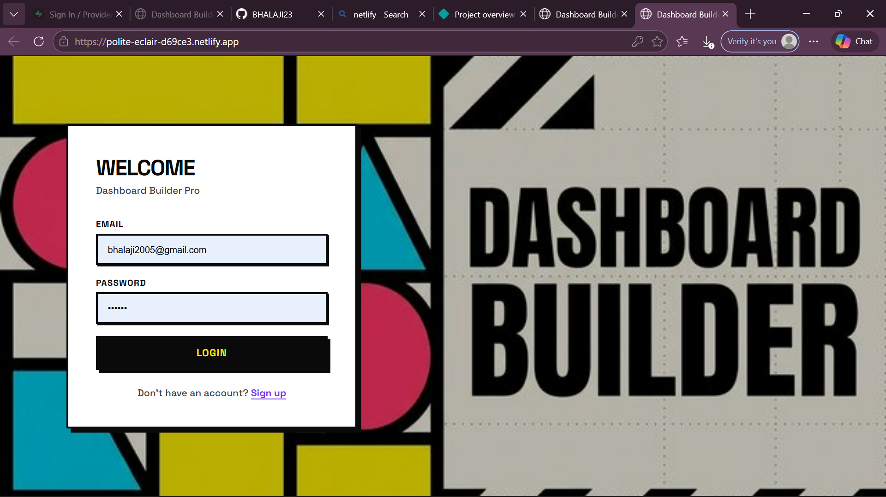
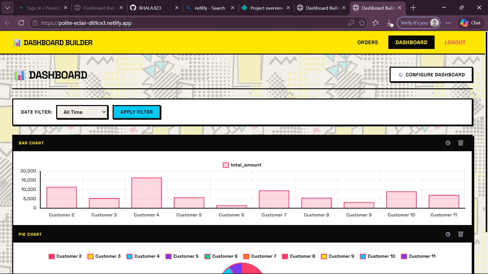
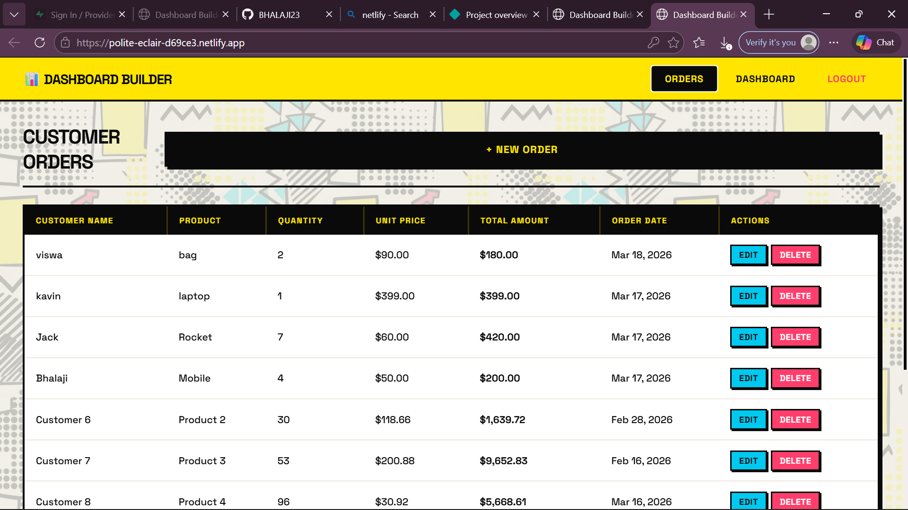

# 🚀 Smart Order Management Dashboard

A modern full-stack web application to manage customer orders with a customizable dashboard and real-time cloud database.

---

## 🌐 Live Demo

👉 https://polite-eclair-d69ce3.netlify.app

---

## 📌 Features

* 🔐 User Authentication (Login / Signup)
* 📦 Customer Order Management (Create, Read, Update, Delete)
* 📊 Interactive Dashboard with draggable widgets
* 🔄 Real-time database integration using Supabase
* 📑 Pagination & Sorting for orders
* 🎨 Modern UI (Neobrutalism)

---

## 🛠️ Tech Stack

* **Frontend:** HTML, CSS, JavaScript
* **Backend:** Supabase (Serverless Backend)
* **Database:** PostgreSQL (via Supabase)
* **Deployment:** Netlify

---

## 📷 Screenshots

## 🎥 Demo Video

👉 Watch full demo here:  
https://drive.google.com/file/d/1hfZ1r-ozaTE4hpXnw5Zk1sAwdhEb_-Qq/view?usp=drive_link

## 🧠 Challenges Faced

* Handling Supabase RLS (Row Level Security)
* Debugging module and import errors
* Managing dynamic UI rendering

---

## 🚀 Future Improvements

* 📱 Mobile app version
* 📊 Advanced analytics dashboard
* 👥 Role-based access control
* 📥 Export data (Excel / PDF)

---

## 👨‍💻 Author

**Bhalaji A**

* GitHub: https://github.com/BHALAJI23

---

## ⭐ Show your support

If you like this project, give it a ⭐ on GitHub!
